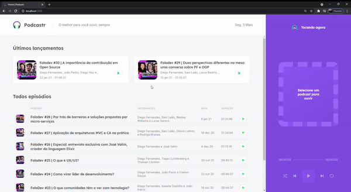

# Project-Podcast-React
Utilizando o Next.js para gerar páginas SSR e SSG (páginas dinâmicas) além das funcionalidades de um PodCast.

    

## Descrição

As tecnologias empregadas no projeto foram basicamente o consumo de dados por intermédio do Json-server e a distribuição da sua rota sendo feita pelo uso do Axios. O ponto forte desse projeto é a maneira de utilizar o SSR e SSG para criar páginas dinâmicas e otimizar a perfomance e recepção para usuário do conteúdo da página. 
